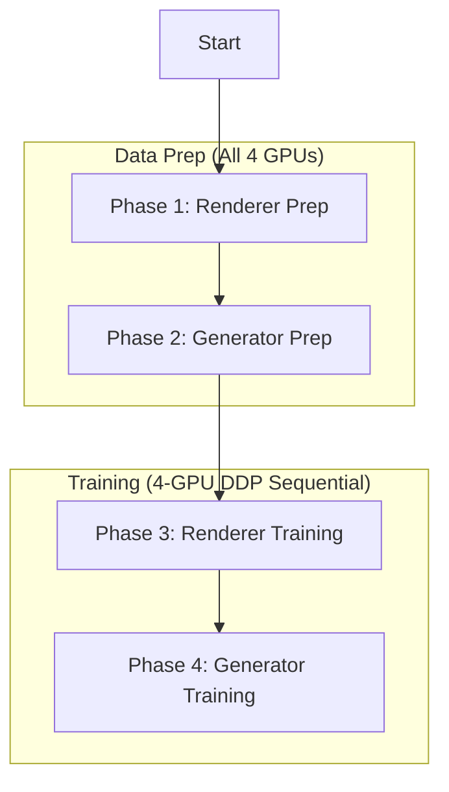

# 📄 IMTalker Technical Report: Custom Training Architecture

This report provides a deep-dive into the adaptations, bug fixes, and infrastructure established to enable high-scale training (15k+ videos) of the IMTalker model on 4x NVIDIA A100 GPUs.

---

## 1. System Architecture & Orchestration

To manage the complexity of training two distinct models (Renderer and Generator) alongside heavy data preprocessing, we implemented a **Multi-Phase Master Orchestrator** (`launch_full_training.sh`).

### The Orchestrator Logic

- **Distributed Data Prep**: We increased parallelism to **8 processes per GPU** (32 total), utilizing the high CPU/GPU bandwidth for concurrent landmark extraction and feature encoding.
- **Sequential Model Execution**: We intentionally run the Renderer training to completion before starting the Generator. This eliminates VRAM fragmentation and ensures the Generator has a dedicated 80GB per GPU for its Flow-Matching Transformer blocks.

---

## 2. Core Code Adaptations & Bug Fixes

Throughout the session, several critical architectural bugs in the base IMTalker code were identified and patched.

### 2.1 The Flow-Matching Dimension Mismatch
**File**: `generator/FM.py` & `generator/FMT.py`
- **Issue**: An unnecessary `.squeeze()` call on the input tensor `x` was stripping the sequence or batch dimension when it reached the Transformer block.
- **Fix**: Removed the squeeze to maintain rank-4/rank-5 tensor consistency. This enabled the `torch.cat([prev_x, x], dim=1)` operation to succeed during the look-behind attention phase.

### 2.2 Dataset Schema Alignment
**File**: `generator/dataset.py`
- **Issue**: The dataset was yielding keys named `gaze_now` and `pose_now`, but the `System` trainer and the `FMGenerator` expected keys named `gaze` and `pose`.
- **Fix**: Standardized all dictionary keys in `__getitem__` to match the model's forward pass requirements.

### 2.3 Renderer Validation Unpacking
**File**: `renderer/train.py`
- **Issue**: The `IMTRenderer` forward pass returns a tuple `(prediction, latent_info)`. The validation loop was treating the output as a single tensor, leading to `AttributeError: 'tuple' object has no attribute 'size'`.
- **Fix**: Updated the validation step to explicitly unpack: `pred, _ = self.gen(...)`.

### 2.4 Scalable Data Splitting
**File**: `renderer/dataset.py`
- **Issue**: The original code used hardcoded index offsets for splitting training and validation data, which fails on custom datasets of different lengths.
- **Fix**: Implemented a dynamic percentage-based split (**95% Train / 5% Val**).

---

## 3. Data Schema & Requirements

### 3.1 Renderer Dataset (`renderer_dataset`)
The Renderer requires raw visual data for image-to-image translation.
- **`video_frame/`**: Directories per video containing 512x512 JPGs.
- **`lmd/`**: Text files containing 68 facial landmarks per frame, normalized to the image coordinates.

### 3.2 Generator Dataset (`generator_dataset`)
The Generator is a feature-based model. It consumes pre-extracted tensors to minimize training-time overhead.
- **`motion/` (`.pt`)**: Latent embeddings from the Renderer's pre-trained Motion Encoder.
- **`audio/` (`.npy`)**: Final-layer features from Fairseq's Wav2Vec2-Base.
- **`smirk/` (`.pt`)**: 3D Pose and expression parameters (via SMIRK).
- **`gaze/` (`.npy`)**: Eye direction vectors (via L2CS-Net).

---

## 4. Hyperparameter Deep-Dive

We optimized the following parameters for the **A100 (80GB)** hardware profile:

| Parameter | Value | Rationale |
| :--- | :--- | :--- |
| **Renderer Batch Size** | 4 (per GPU) | Balances memory usage (~50GB) with gradient stability. |
| **Generator Batch Size** | 16 (per GPU) | The Generator is lighter on memory; 16 allows for faster convergence. |
| **Learning Rate** | 1e-4 | Standard for Adam optimizer in flow-matching and GAN-based renderers. |
| **Iterations** | 50,000 | Targeted initial convergence for custom fine-tuning. |
| **DDP Strategy** | `ddp_find_unused_parameters_true` | Required because the Renderer's dual-path encoders (Appearance/Motion) may not always trigger every branch in every step. |

---

## 5. Live Monitoring Systems

### 5.1 Real-Time Loss Curves
We injected a custom `LossPlotterCallback` using `matplotlib` into both training scripts. 
- **Frequency**: Plots and saves every 1,000 steps.
- **Location**: Exp folder (`custom_renderer/loss_curve.png`).
- **Benefit**: Allows visual confirmation of convergence without needing an external TensorBoard connection.

### 5.2 Logging Architecture
- **`pipeline_restart.log`**: Standard output and error for the orchestrator.
- **`full_prep_renderer.log`**: TQDM progress bars for the massively parallel preprocessing worker.
- **`renderer_train.log`**: Detailed PyTorch Lightning logs, inclusive of epoch/step-wise metrics.

---

## 6. How to Extend / Resume

To resume training from a specific checkpoint:
1. Update `train_renderer.sh` or `train_generator.sh`.
2. Add the `--resume_ckpt /path/to/checkpoint.ckpt` flag to the python command.
3. If only resuming training (skipping data prep), you can run the `.sh` scripts directly instead of the master orchestrator.

---
**Report generated for:** 4x A100 Training Cluster
**Date**: February 9, 2026
